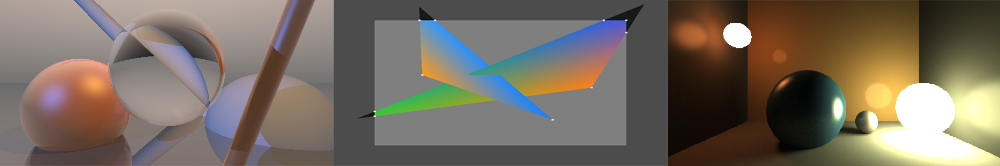

# UCLComputerGraphics Rendering System

This website hosts the [UCL Computer Graphics rendering system](https://uclcg.github.io/uclcg/public/html/index.html). 
The system implements an online framework for executing WebGL code and for 
implementing and the coursework and assignments. Please have a look at the submission info below. 

## Get Started  

To get started, please have a look at the [WebGL spec](https://www.khronos.org/registry/webgl/specs/latest/1.0/)
and the OpenGL ES Shading Language [GLSL](https://www.khronos.org/files/opengles_shading_language.pdf).
We have prepared three simple demo scripts ([demo1](demos/cameraSimple.uclcg), [demo2](demos/openGL.uclcg), [demo3](demos/splines.uclcg)) to help you get started.
You can look at and play with the code to get a feel for the system and for graphics programming. 
To do so, go to the [renderer](https://uclcg.github.io/uclcg/public/html/index.html) and click "Load Setup" in the right upper corner's dropdown menu. 
After uploading the `.uclcg` demos, it should show the code and the corresponding rendered image. 

## How To Use 

For the coursework submissions, we will provide `.uclcg` files that contain template 
skeletons for the respective tasks that need to be solved. Uncomment the `#define` statements in the 
first few lines to activate the respective subtasks. Put your code between the respective `#ifdef` and hit `ctrl/cmd + s` to update the render view.
Remember to frequently save your progress - to do so, the system provides the 'Save Setup' functionality in the dropdown menu in the upper right corner. 

## Courseworks

- CW 1: TBA 
- CW 2: TBA 
- CW 3: TBA 

## Important Submission Information 

- **Check your defines:** When we correct your submissions and there is an error, we need to check each task separately to find out what's wrong. This is why we included the `#define` statements. Do not change or alter their structure and verify that your code compiles when they are commented out. The desired behaviour is: all defines commented but the first one: image for task 1 displayed. All defines commented but first and second: image for task 2 displayed, and so on. **Non-compliance might result in point deduction!**
- **Do NOT copy-paste your code into a .txt file and simply name it `*.uclcg`**, as this will not be renderable by the system. Instead, use the provided "Save Setup" functionality in the right upper corner, so that we can "Load Setup" your submission.
- **Do NOT alter the javascript code** that is contained in the `.uclcg` file you download.
- You will not have to use any other programming languages, so please do not write answers in other languages, paper, or pseudo-code. 
- Remember to frequently save your progress as a `.uclcg` file. In the end, hand in that file via Moodle. The filename should not contain your name. 
- You should not have to change any other parts than the `#ifdef` statements. Please refrain from changing constants like background color, primitive position, etc., as this will make it harder to verify the correctness of your submissions. 
